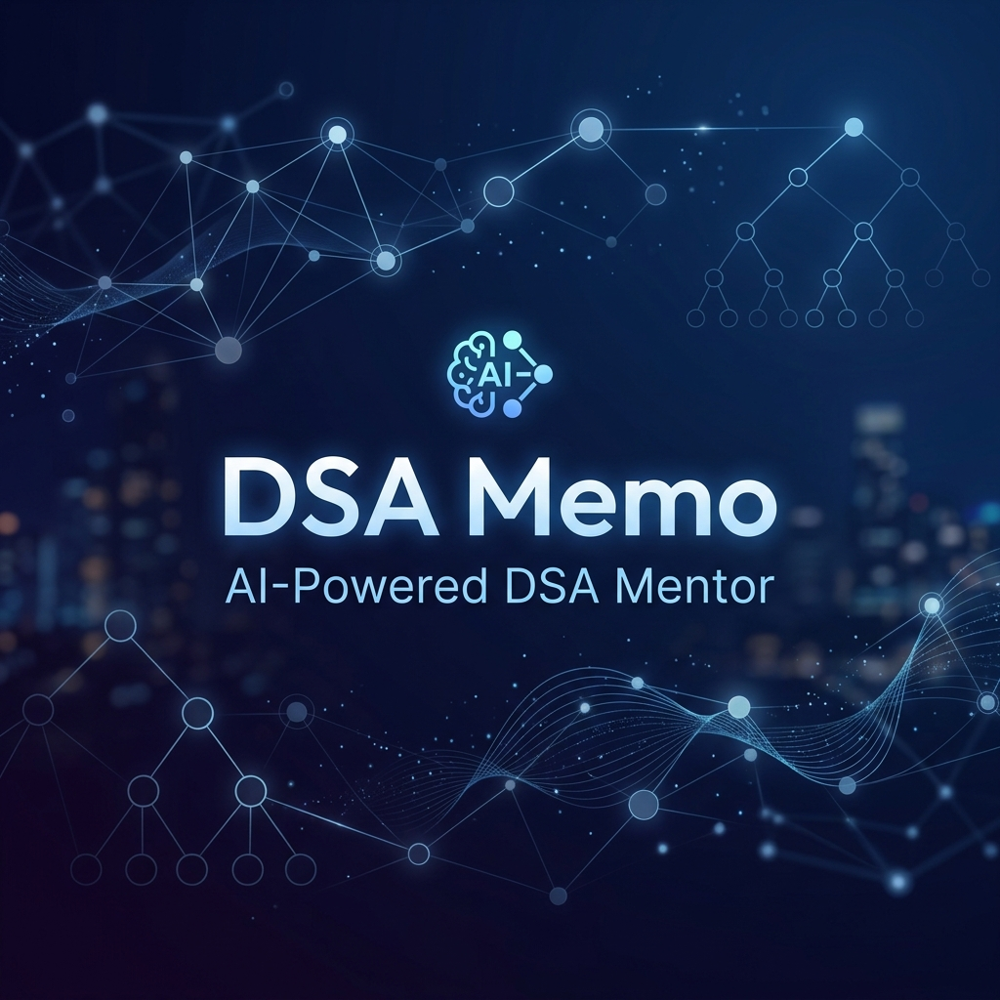
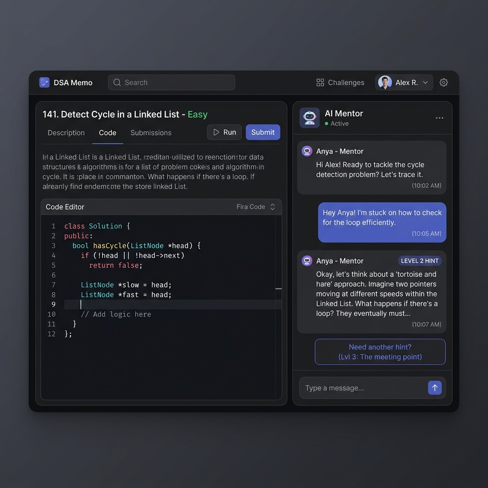

<div align="center">



# 🧠 DSA Memo — Your AI-Powered DSA Mentor

[](LICENSE)
[](https://react.dev/)
[](https://www.typescriptlang.org/)
[](https://vitejs.dev/)
[](https://tailwindcss.com/)
[](https://groq.com/)

**Stop copying solutions. Start mastering concepts.**  
DSA Memo is a personal, browser-based study environment designed to facilitate deep learning of Data Structures & Algorithms. It doesn't just give you the answer; it acts as a mentor that adjusts its guidance based on your struggle.

[Explore Features](#-features) • [Quick Start](#-quick-start) • [Tech Stack](#-tech-stack) • [How It Works](#-how-it-works)

</div>

---

## 📸 Sneak Peek



---

## 🌟 Features

### 📶 Progressive Hint System (The "Nudge" Philosophy)
Why settle for a spoiler? DSA Memo's unique 6-level hint system ensures you only get as much help as you need to break through your current block.

| Level | Mode | What You Get |
| :--- | :--- | :--- |
| **0** | 🔍 **Clarify** | Deep dive into the problem statement. No hints, just understanding. |
| **1** | 💡 **Nudge** | A tiny directional hint. A pattern name or an observation. |
| **2** | 🧩 **Concept** | The core insight explained via a mini analogous example. |
| **3** | 🐞 **Debug** | Analysis of YOUR code. Logic error spotting & edge case reveals. |
| **4** | 🏗️ **Algorithm** | Step-by-step logic construction & complexity analysis. No code. |
| **5** | 🚀 **Solution** | Full C++/Python solution with dry runs & optimization tips. |

### 🧠 AI-Powered Intelligence
- **Problem Normalizer**: Paste a LeetCode URL, a GeekForGeeks link, or just a title. Our AI extracts constraints, examples, and difficulty automatically.
- **Streaming Context**: Ultra-fast responses via Groq's Llama-3.3-70B model. It remembers your code and your previous questions.
- **Voice Synthesis**: Hear your mentor! Integrated **PlayAI TTS** for realistic voice readback of assistant messages.

### 📓 Knowledge Management
- **Insight Capture**: Hit one button to generate a structured takeaway from your session.
- **Google Sheets Sync**: Save your learnings to a live spreadsheet for long-term retention and interview prep.
- **Analytics Dashboard**: Track time spent, difficulty distribution, and "struggle" metrics.

---

## 🛠️ Tech Stack

- **Frontend**: React 19, TypeScript, Tailwind CSS
- **Build Tool**: Vite
- **AI Core**: Groq SDK (`llama-3.3-70b-versatile`)
- **Voice**: PlayAI TTS (`fritz-playai`)
- **Database/Persistence**: Google Sheets API v4 (JWT via Web Crypto API)
- **UI Components**: Custom glassmorphic design system

---

## 🚀 Quick Start

### 1️⃣ Clone and Install
```bash
git clone https://github.com/your-username/DSA-Memo.git
cd DSA-Memo
npm install
```

### 2️⃣ Configure Environment
Create a `.env` file in the root directory:
```env
# Essential
GROQ_API_KEY=your_groq_api_key

# Optional (for Google Sheets Sync)
GOOGLE_SHEET_ID=your_sheet_id
GOOGLE_SERVICE_ACCOUNT_TYPE=service_account
GOOGLE_PROJECT_ID=...
GOOGLE_PRIVATE_KEY="..."
GOOGLE_CLIENT_EMAIL=...
# ... (see .env.example for full details)
```

### 3️⃣ Launch
```bash
npm run dev
```
Open [http://localhost:5173](http://localhost:5173) and start solving!

---

## 🏗️ Project Structure

```text
DSAMemo/
├── 📁 components/        # Modular UI (Chat, Editor, Analytics, Modals)
├── 📁 services/          # Groq AI & Google Sheets integrations
├── 📄 App.tsx            # Main application orchestration & state
├── 📄 types.ts           # Centralized type definitions
├── 📄 geminiService.ts   # AI logic (Hinting, Normalization)
└── 📄 googleSheets.ts    # Persistence logic
```

---

## 🗺️ Roadmap

- [ ] **Multi-language Support**: Support for Java, JS, and Go in hint level 5.
- [ ] **Visual Debugger**: Auto-generate tree/graph diagrams for Linked List/Tree problems.
- [ ] **Problem Bank**: Integrated database of 500+ curated DSA patterns.
- [ ] **PDF Export**: Export your session takeaways as a beautiful PDF summary.

---

## ⚖️ License

Distributed under the MIT License. See `LICENSE` for more information.

---

<div align="center">
Built with ❤️ for the DSA community.  
<b>Happy Solving!</b>
</div>

